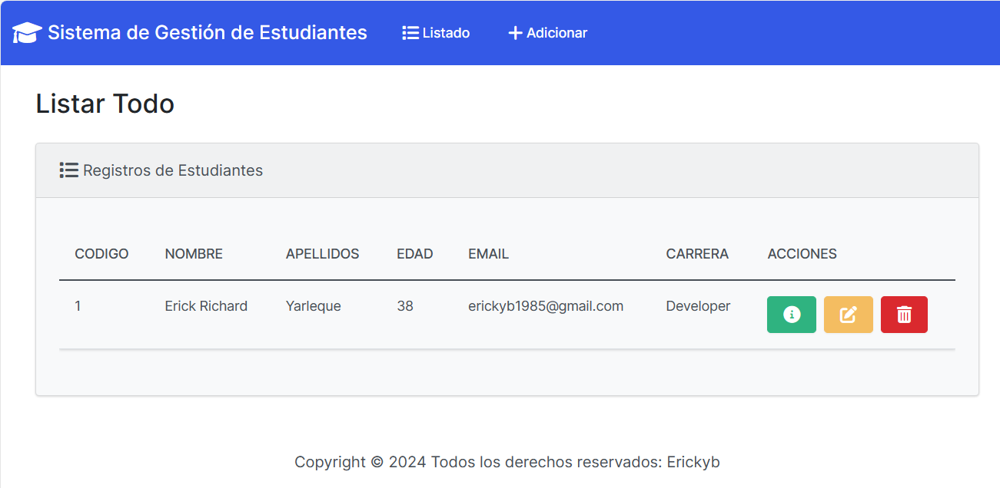
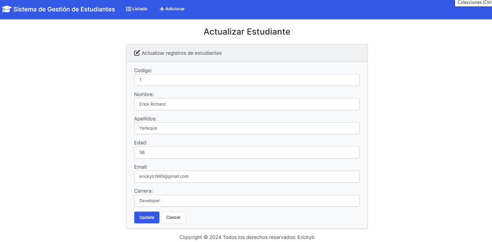
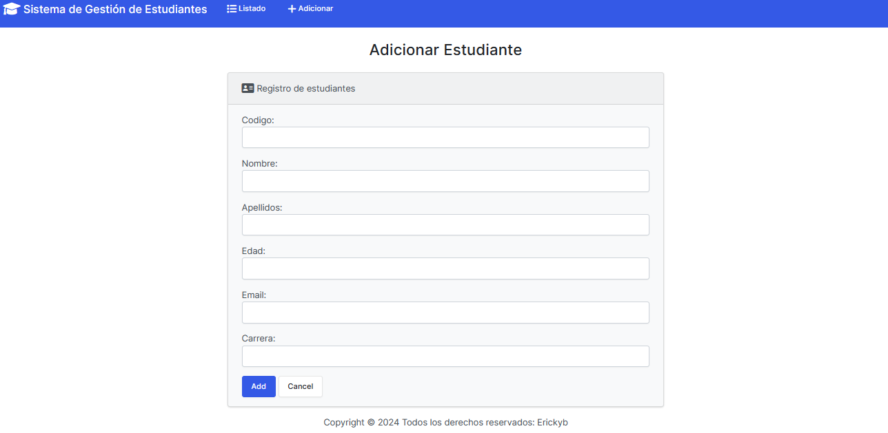
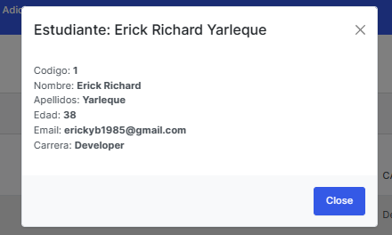

## **Web de lista de Alumnos**

creado con **PYTHON** Y **Django** con una base de datos en **db.sqlite3** este proyecto tiene **CRUD** y también se utilizo **BOOTSTRAP 5** para hacer más fácil el proyecto.
que para realizar un proyecto se requiero de estos dos comandos

# Comandos
- Primer Comandos: django-admin startproject WebAlumnos.
- Segundo Comando: django-admin startapp app.

# Crear las Tablas:
La creación son con lo comando:
- py manage.py migrate
- py manage.py makemigrations

# La imagen
- 
- 
- 
- 

# video:
Es el funcionamiento de la **Web Alumnos**
- Sistema de proyecto 
[Web Alumnos](https://youtu.be/gLYupRmdUkE)

